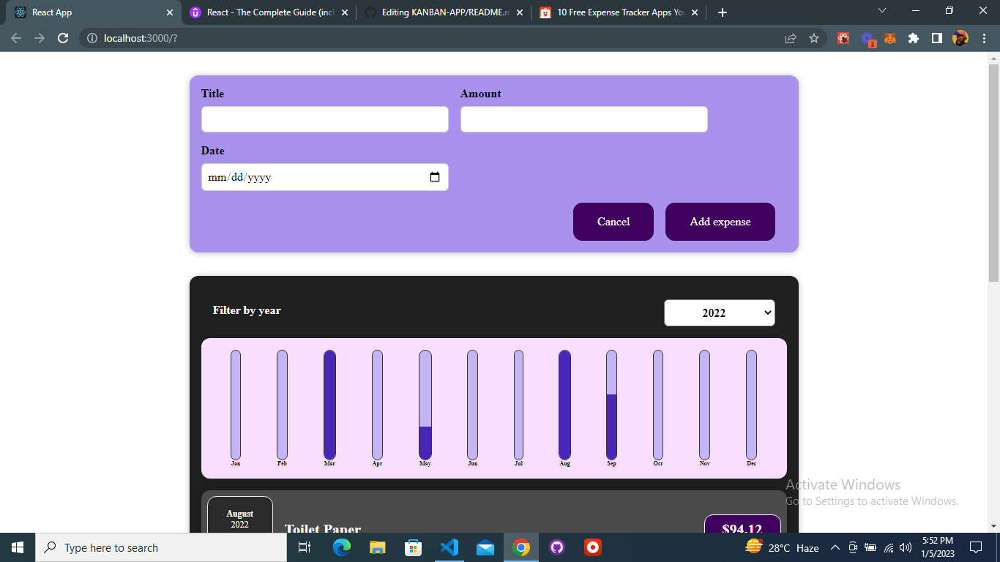
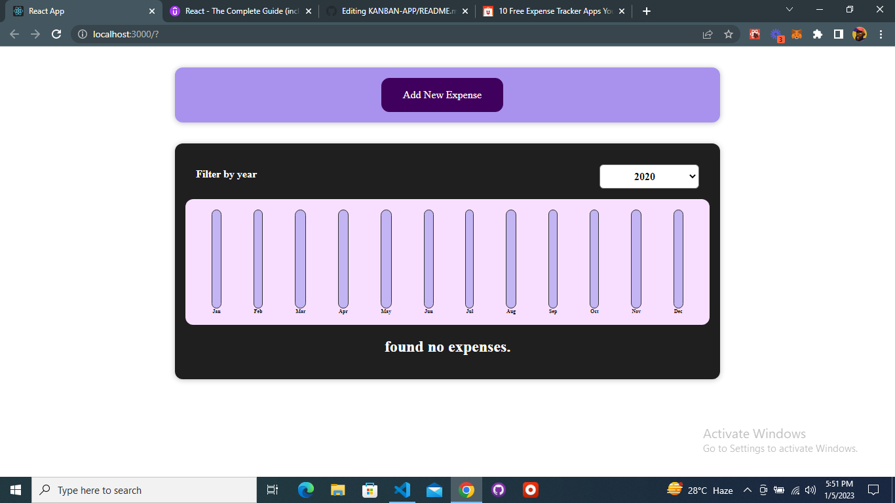

## About web-app

Someone once said, “If you fail to plan, you plan to fail”.

So after I’ve failed to manage my finances, I decided that something needs to be done about my spending habits. Thus, I decided to build an expense tracking web-app in order to help me better manage my personal finances, lest I spend all of my salary on food delivery and online shopping.

## Table of contents

- [Overview](#overview)
  - [The challenge](#the-challenge)
  - [Links](#links)
  - [Built with](#built-with)
- [Author](#author)

## Overview

### The challenge

Users should be able to:

- Work with components
- React state and working with events
- Rendering list and conditional content
- Styling react components

### Links

- Live Site URL: [MccGrey-extracker](https://mccgrey-extracker.netlify.app/)

### Built with

- Semantic HTML5 markup
- CSS custom properties
- Mobile-first workflow
- [React](https://reactjs.org/) - JS library
- [Styled Components](https://styled-components.com/) - For styles

## Author

### AGUONYE CORNELIUS (MCCGREY)

- LinkedIn - [@mccgrey](https://www.linkedin.com/in/mccgrey)
- Twitter - [@browncheese6](https://www.twitter.com/browncheese6)
- Github - [@MccGrey](https://github.com/MccGrey)
